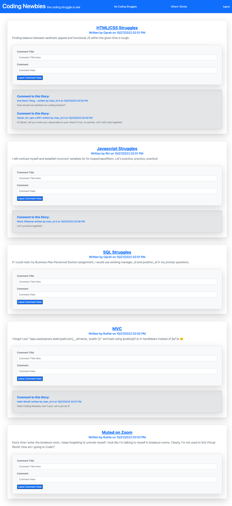

# RYK-MVC-Tech-Blog

## User Story

```md
AS A coding newbie who makes a lot of mistakes
I WANT a CMS-style blog site
SO THAT I can record my mistakes and try not to repeat them in the near future and laugh with other coding newbies
```
## Acceptance Criteria

```md
GIVEN a CMS-style blog site
WHEN I visit "Coding Newbies"
THEN I can read existing stories in the homepage
WHEN I try to leave a comment on others' stories or share my own coding experience as a newbie
THEN I must sign up
WHEN I create username and password in the signup page
THEN I can click "Save My Info"
WHEN I am logged in
THEN I am able to create, delete and update "My Coding Struggles" and am able to leave comments on others' stories
WHEN I am idle on the site for 5 hours
THEN I am automatically logged out 
WHEN I click on the logout 
THEN I am signed out of the site
```
## Work References

* Office Hours and Free Tutoring
* RUT-VIRT-FSF-PT-06-2022-U-LOLC/14-MVC/01-Activities/28-Stu_Mini-Project
* [Previous Assignment](https://github.com/leanonruthie/ORM-Sequelize-Express-E-Commerce.git)
* [Our Group Project #2](https://enigmatic-gorge-61389.herokuapp.com/)

## CSS Framework
Bootstrap inline-script utilized in handlebars to save time and convenience

## Screenshots

* Homepage aka Others' Stories with Comment Functionality (Works with Live Items and Seeded Items)


* Login | Signup (Works with Live and Seeded Items)


* Create and Delete Functionality in My Coding Struggles (Works with Live and Seeded Items)


* My Story by ID with Update Functionality (Works with Live and Seeded Items)


## Deployed URL

* [My GitHub](https://github.com/leanonruthie/RYK-MVC-Tech-Blog.git)
* [My Heroku](https://mysterious-basin-98274.herokuapp.com/)
